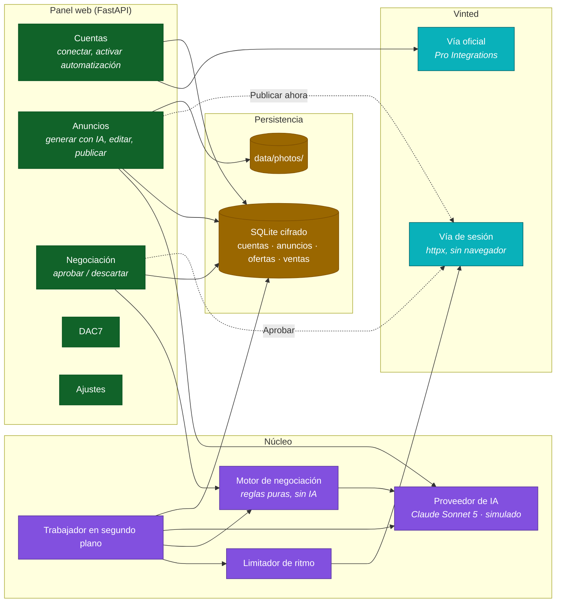
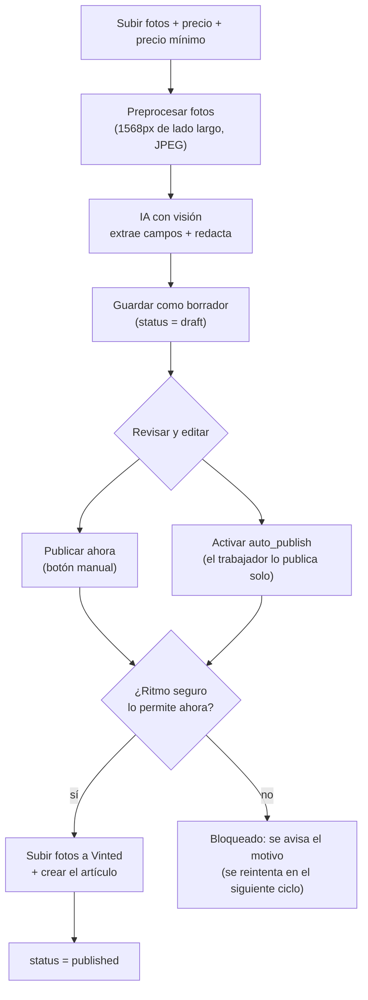
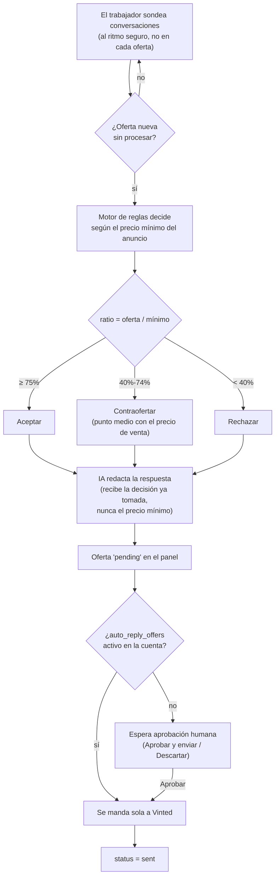

# VintedBot

[](https://github.com/MartXXeL/VintedBot/actions/workflows/tests.yml)


Herramienta de automatización para revendedores en **Vinted**: sube fotos de un
artículo y una IA con visión rellena categoría, marca, talla y estado, y
redacta un título y una descripción listos para publicar; cuando llega una
oferta de un comprador, un motor de reglas (sin IA) decide si se acepta,
se contraoferta o se rechaza según un precio mínimo que la IA nunca ve, y
solo entonces la IA redacta la respuesta en tono amable — pendiente de tu
aprobación en el panel, salvo que actives explícitamente el envío automático.

## Índice

- [Idea y alcance](#idea-y-alcance)
- [Arquitectura](#arquitectura)
- [Flujo de un anuncio](#flujo-de-un-anuncio)
- [Flujo de una negociación](#flujo-de-una-negociación)
- [Herramientas elegidas y por qué](#herramientas-elegidas-y-por-qué)
- [Estructura del proyecto](#estructura-del-proyecto)
- [Puesta en marcha](#puesta-en-marcha)
- [Variables de entorno](#variables-de-entorno)
- [El panel web](#el-panel-web)
- [Pruebas e integración continua](#pruebas-e-integración-continua)
- [Seguridad](#seguridad)
- [Cumplimiento fiscal (DAC7)](#cumplimiento-fiscal-dac7)
- [Planes de precio](#planes-de-precio)
- [Limitaciones conocidas](#limitaciones-conocidas)
- [Aviso](#aviso)
- [TODO](#todo)

## Idea y alcance

Dos piezas independientes:

1. **Generador de anuncios**: subes fotos de un artículo en el panel; un
   modelo de IA con visión (Claude Sonnet 5, con un proveedor simulado de
   respaldo) identifica marca, talla, estado y categoría, y redacta título y
   descripción en tono informal. Todo queda como borrador editable — nada se
   publica sin pasar por `/listings/{id}/edit` primero.
2. **Agente de negociación**: cuando llega una oferta, un módulo de código
   (sin IA) la compara contra un precio mínimo guardado aparte y decide
   **aceptar** (≥75% del mínimo), **contraofertar** (40-74%) o **rechazar**
   (<40%). Solo después la IA redacta la respuesta — recibe la decisión ya
   tomada, nunca el precio mínimo ni la proporción — y la oferta queda
   pendiente de aprobación humana en el panel salvo que actives el envío
   automático por cuenta.

Conexión con Vinted por dos vías, igual que se plantea el problema real: la
**vía oficial** (Vinted Pro Integrations, requiere alta como vendedor
profesional) para artículos y pedidos, y una **vía de sesión** de respaldo
para lo que la vía oficial no cubre (mensajería y ofertas), con un limitador
de ritmo que respeta la cadencia de seguridad documentada para no arriesgar
las cuentas conectadas.

No hace falta pilotar un navegador completo: las acciones que importan
(crear anuncio, leer/responder ofertas) tienen forma de petición HTTP, así
que el cliente de la vía de sesión es HTTP directo (`httpx`), sin Playwright
ni ningún navegador de por medio.

## Arquitectura



| Módulo | Responsabilidad |
|---|---|
| `src/core/` | Configuración (`.env`), logger, hash de la contraseña del panel |
| `src/storage/` | Cifrado en reposo (Fernet) + persistencia SQLite: cuentas, anuncios, ofertas, ventas, registro de acciones |
| `src/vinted/` | Modelos de datos, clientes (API oficial y sesión), limitador de ritmo |
| `src/negotiation/` | Motor de decisión puro: aceptar / contraofertar / rechazar, sin IA ni red |
| `src/ai/` | Proveedores de IA (Anthropic + simulado), preprocesado de fotos, redacción de anuncios y respuestas |
| `src/compliance/` | Seguimiento fiscal DAC7 por cuenta |
| `src/billing/` | Planes de precio (por cuenta + volumen) y estimación de coste de IA |
| `src/worker/` | Trabajador en segundo plano: publica y negocia al ritmo seguro |
| `src/ui/` | Panel web: FastAPI, plantillas Jinja2, estáticos propios |
| `docs/vinted_api_notes.md` | Qué endpoints usa cada vía, con su nivel de certeza, y qué hacer cuando uno deje de funcionar |

## Flujo de un anuncio



## Flujo de una negociación



## Herramientas elegidas y por qué

Aquí todo lo que importa tiene forma de petición HTTP — no hace falta
pilotar un navegador ni nada parecido a un anti-detección — así que el
stack es deliberadamente ligero: lo justo para un panel con seis pantallas
y un trabajador en segundo plano, sin más.

| Necesidad | Elección | Por qué |
|---|---|---|
| Panel web + API | **FastAPI** + **Uvicorn** | Async nativo (encaja con `httpx` y el trabajador en segundo plano dentro del mismo proceso), validación de formularios integrada, y mucho más rápido de construir bien que un servidor HTTP a medida para un panel con seis pantallas |
| Plantillas | **Jinja2** | Viene con FastAPI, server-rendered con formularios + redirects (patrón Post/Redirect/Get): sin SPA, sin build step |
| Cliente HTTP | **httpx** (async) | Único cliente para las dos vías de Vinted; `httpx.MockTransport` prueba ambas sin red real |
| IA con visión | **SDK oficial de Anthropic** (Claude Sonnet 5) | El modelo citado en la idea original; herramientas (`tool_choice`) para forzar una salida JSON fiable en vez de parsear texto libre |
| Preprocesado de fotos | **Pillow** | Redimensionar a 1568px antes de mandar a la IA baja el coste de tokens sin perder detalle útil |
| Persistencia | **SQLite** (`sqlite3` de la librería estándar) | El volumen de un revendedor (cientos de anuncios, no millones) no justifica un servidor de base de datos aparte |
| Cifrado en reposo | **cryptography** (Fernet) | Protege la sesión de cada cuenta y el precio mínimo de cada anuncio en el `.db` |
| Cobro por suscripción | **Stripe** (cliente scaffolded en `src/billing/`) | El SDK de facto para checkout + webhooks; no activo sin `STRIPE_SECRET_KEY` |
| Calidad | **ruff** + **pytest** + **pytest-asyncio** | Lint y tests en cada push, sin depender de un navegador para probar la lógica |
| CI | **GitHub Actions** | Un único job: aquí no hace falta separar unitarios de integración porque no hay ningún navegador headless que instalar |

**Identidad visual propia**: tipografía **Fraunces** (títulos) + **IBM Plex
Sans**/**IBM Plex Mono** (texto y cifras), paleta cálida en tono oscuro
(latón + verde salvia) y formas planas sin degradados ni "glow" — a
propósito, para no parecer un dashboard genérico de plantilla.

## Estructura del proyecto

```
src/
  core/         Configuración, .env, logger, hash de contraseñas
  storage/      Cifrado en reposo (Fernet) y persistencia SQLite
  vinted/       Modelos de datos, clientes (API oficial y sesión), limitador de ritmo
  negotiation/  Motor de decisión puro (aceptar/contraofertar/rechazar)
  ai/           Proveedores de IA (Claude Sonnet 5 con visión + simulado)
  compliance/   Seguimiento fiscal DAC7 por cuenta
  billing/      Planes de precio y cobro por Stripe
  worker/       Trabajador en segundo plano (publica y negocia al ritmo seguro)
  ui/           Panel web: FastAPI, rutas, plantillas Jinja2, CSS/JS propios
  main.py       Punto de entrada: `python -m src.main`

tests/unit/     Pruebas unitarias — lógica pura y dobles de prueba, sin red
docs/vinted_api_notes.md      Qué endpoints usa cada vía y su nivel de certeza
.github/workflows/tests.yml   CI: lint + tests en cada push
```

## Puesta en marcha

Requisitos: Python 3.12+. Opcional: clave de la API de Anthropic
(<https://console.anthropic.com>) para IA de verdad — sin ella, el panel
arranca igual con un proveedor de IA simulado.

```bash
git clone https://github.com/MartXXeL/VintedBot.git
cd VintedBot

pip install -r requirements.txt
cp .env.example .env

python -m src.main
```

Esto levanta el panel en `http://127.0.0.1:8080`. En el primer arranque se
genera una contraseña del panel y se muestra **una sola vez** en la
consola — apúntala. El trabajador en segundo plano arranca en el mismo
proceso: sin cuentas conectadas, o con `auto_publish`/`auto_reply_offers`
desactivados, simplemente no tiene nada que hacer.

## Variables de entorno

Todas tienen un valor por defecto sensato; la mayoría también se pueden
editar desde **Ajustes** en el propio panel (que reescribe `.env`).

| Variable | Obligatoria | Por defecto | Descripción |
|---|---|---|---|
| `DASHBOARD_HOST` / `DASHBOARD_PORT` | No | `127.0.0.1` / `8080` | Dónde escucha el panel |
| `DASHBOARD_PASSWORD_HASH` | No | se genera | Contraseña del panel (hash, nunca texto plano) |
| `DASHBOARD_FORCE_HTTPS` | No | `false` | `Secure` en la cookie de sesión (solo detrás de HTTPS) |
| `DB_ENCRYPTION_KEY` | No | se genera | Clave del cifrado en reposo — no la pierdas |
| `ANTHROPIC_API_KEY` | No | — | Sin ella, IA simulada |
| `ANTHROPIC_MODEL` | No | `claude-sonnet-5` | Modelo de IA con visión |
| `AI_PROVIDER` | No | `auto` | `auto` (IA real si hay clave) / `anthropic` / `mock` |
| `VINTED_DOMAIN` | No | `www.vinted.es` | Dominio para la vía de sesión |
| `VINTED_API_BASE_URL` / `VINTED_API_CLIENT_ID` / `VINTED_API_CLIENT_SECRET` | No | — | Vía oficial (Pro Integrations) |
| `RATE_LIMIT_MIN_SECONDS` / `RATE_LIMIT_MAX_SECONDS` | No | `180` / `600` | Cadencia entre acciones de la vía de sesión |
| `RATE_LIMIT_MAX_ACTIONS_PER_DAY` | No | `50` | Tope de acciones en 24h por cuenta |
| `RATE_LIMIT_NIGHT_START_HOUR` / `RATE_LIMIT_NIGHT_END_HOUR` | No | `23` / `8` | Pausa nocturna (24h, hora local) |
| `DAC7_ALERT_AMOUNT_EUR` / `DAC7_ALERT_TRANSACTIONS` | No | `2000` / `30` | Umbrales de aviso DAC7 |
| `STRIPE_SECRET_KEY` / `STRIPE_WEBHOOK_SECRET` | No | — | Cobro por suscripción (sin activar sin ellas) |
| `DATABASE_PATH` | No | `data/vintedbot.db` | Ruta de la base de datos |

## El panel web

- **Cuentas**: conectar una cuenta (sesión o API oficial), activar
  publicación/respuesta automáticas por cuenta, ver cuántas acciones lleva
  hoy frente al tope diario. Si Vinted rechaza una publicación o una
  respuesta (sesión caducada), la cuenta pasa sola a "Error"; **Reconectar
  sesión** renueva la cookie sin borrar la cuenta ni perder sus anuncios y
  ofertas — cada acción que vuelve a funcionar la devuelve a "Conectada".
- **Anuncios**: generar un borrador con IA a partir de fotos, revisarlo y
  editarlo, publicarlo a mano o dejar que el trabajador lo publique solo.
- **Negociación**: ofertas ya decididas y redactadas, a la espera de
  Aprobar y enviar o Descartar (salvo envío automático activado).
- **DAC7**: ingresos y transacciones del año por cuenta frente a los
  umbrales de aviso.
- **Suscripción**: uso real (cuentas + anuncios del mes) frente a los tres
  planes, con el recomendado marcado; botón de Stripe Checkout si hay
  clave configurada.
- **Ajustes**: IA, Vinted, ritmo seguro, umbrales DAC7 y Stripe — escribe
  en `.env`; algunos cambios (sobre todo el proveedor de IA) piden
  reiniciar el proceso para aplicarse del todo.

## Pruebas e integración continua

```bash
pip install -r requirements.txt
ruff check src tests
pytest tests/unit -q
```

Sin navegador ni credenciales: los clientes HTTP de Vinted se prueban con
`httpx.MockTransport`, el cliente de Anthropic con un doble inyectado, el
proveedor de IA simulado (`MockAIProvider`) cubre todo el flujo de
generación y negociación sin gastar un céntimo, y el panel se prueba de
verdad con `fastapi.testclient.TestClient` (login, formularios, subida de
fotos por multipart, redirecciones). GitHub Actions
(`.github/workflows/tests.yml`) ejecuta el linter y la suite completa en
cada push y pull request contra `main` — el badge de arriba refleja su
estado.

## Seguridad

- **Login del panel**: contraseña con PBKDF2-HMAC-SHA256 (260.000
  iteraciones, con sal), nunca en texto plano; bloqueo de 5 minutos tras 5
  intentos fallidos por IP; sesión con cookie `HttpOnly`+`SameSite=Lax`
  (+`Secure` con `DASHBOARD_FORCE_HTTPS`).
- **Cifrado en reposo**: la sesión de cada cuenta de Vinted y el precio
  mínimo de cada anuncio se cifran con Fernet/AES antes de tocar disco; la
  clave se genera sola y vive en `.env` (`DB_ENCRYPTION_KEY`).
- **El precio mínimo nunca llega a la IA**: el motor de negociación
  (`src/negotiation/engine.py`) es código puro que decide con el precio
  mínimo delante; la IA solo recibe la decisión ya tomada
  (`NegotiationDecision.to_ai_context()`), sin precio mínimo ni proporción.
- **Sin credenciales en el repositorio**: `.env` y `data/` (base de datos,
  fotos subidas) están en `.gitignore`.
- **Fotos detrás de login**: las fotos de un anuncio se sirven desde
  `GET /listings/{id}/photos/{i}` (protegida como el resto del panel), no
  desde una carpeta estática suelta — así una foto no queda accesible sin
  sesión aunque alguien adivine o filtre su URL.
- **Sin anti-detección**: la vía de sesión hace peticiones HTTP normales
  con la cookie del propio usuario — nada de proxies, huellas de navegador
  falsas ni rotación de user-agent. La protección de la cuenta es
  `src/vinted/rate_limiter.py`: cadencia mínima, tope diario y pausa
  nocturna, igual o más estrictos que lo documentado como seguro.
- Si expones el panel fuera de tu red local, añade HTTPS real, firewall y
  preferiblemente VPN — el login y el cifrado protegen el panel, no el
  servidor donde corre. Si `DASHBOARD_HOST` deja de ser loopback sin
  `DASHBOARD_FORCE_HTTPS=true`, el arranque avisa por consola de que la
  cookie de sesión viajaría sin cifrar.

## Cumplimiento fiscal (DAC7)

La Directiva (UE) 2021/514 obliga a las plataformas a reportar los datos de
un vendedor cuando, en un año natural, supera **cualquiera** de dos
umbrales: 2.000€ de ingresos o 30 transacciones (por defecto;
configurables en Ajustes). La pestaña **DAC7** del panel avisa con
antelación cuándo una cuenta se acerca o ya los supera —
`src/compliance/dac7.py` es lógica pura, no presenta nada ante Hacienda ni
sustituye asesoría fiscal.

Los datos vienen de verdad: cuando un anuncio publicado se vende, el botón
**Marcar como vendido** (en la ficha del anuncio) registra el importe real
en `sales` — sin eso, DAC7 nunca tendría nada que evaluar.

## Planes de precio

`src/billing/plans.py` modela el cobro **por cuenta conectada y volumen de
anuncios**, no por usuario (un mismo cliente suele conectar varias cuentas):
tres planes (Starter/Pro/Scale, 30-120€/mes) con una cuota incluida de
cuentas y anuncios, y el exceso cobrado por unidad. `estimate_ai_cost_usd`
calcula el coste real de una llamada a la IA con los precios de Claude
Sonnet 5 (3 $/M tokens de entrada, 15 $/M de salida): generar un anuncio
completo cuesta del orden de un céntimo de dólar, muy por debajo de
cualquiera de los planes.

La pestaña **Suscripción** del panel muestra el uso real (cuentas conectadas
+ anuncios del mes) frente a los tres planes y su plan recomendado; con
`STRIPE_SECRET_KEY` configurada (Ajustes), el botón "Suscribirse" abre un
Stripe Checkout de verdad (`src/billing/stripe_client.py`), y
`POST /billing/webhook` verifica la firma de los eventos entrantes — sin
clave, la pestaña sigue mostrando los números pero oculta el botón de pago.

## Limitaciones conocidas

- **Los endpoints de ofertas de la vía de sesión no están confirmados al
  100%.** Vinted no publica una API pública; `src/vinted/session_client.py`
  usa el patrón de varios wrappers no oficiales independientes (alta
  certeza en fotos/artículos, media en conversaciones, **baja en
  aceptar/rechazar/contraofertar una oferta**, ver
  [docs/vinted_api_notes.md](docs/vinted_api_notes.md)). No se puede
  verificar sin una cuenta de Vinted real conectada — es lo primero a
  comprobar contra tráfico real antes de usarlo con una cuenta que importe.
- **Guardar en Ajustes no reinicia el proceso.** Los cambios en `.env` se
  reflejan al instante en la configuración en memoria, pero algo ya
  construido al arrancar (el cliente de Anthropic del trabajador, p. ej.)
  solo lo recoge un reinicio real.
- **El webhook de Stripe solo registra el evento.** Sin un modelo de
  clientes/suscripciones propio (el panel es de un solo operador),
  `POST /billing/webhook` verifica la firma y lo deja logueado — conectarlo
  a algo persistente (marcar la suscripción como activa, etc.) depende de
  cómo se termine desplegando VintedBot como servicio.

## Aviso

Automatizar una cuenta de Vinted por la vía de sesión puede ir contra sus
Términos de Servicio (riesgo de suspensión 24-72h o shadowban 7-14 días si
se automatiza sin freno) — `src/vinted/rate_limiter.py` existe
precisamente para reducir ese riesgo, no para eliminarlo. El envío
automático de respuestas a ofertas (`auto_reply_offers`) y la publicación
automática (`auto_publish`) están **desactivados por defecto**: el diseño
asume que revisas lo que la IA propone antes de que se mande con dinero de
por medio. El seguimiento DAC7 es informativo, no asesoría fiscal. Tú
decides y asumes esos riesgos.

## TODO

- [x] Estructura del proyecto y dependencias
- [x] Utilidades base (configuración, cifrado en reposo, logger)
- [x] Modelos de datos de Vinted (cuenta, anuncio, oferta)
- [x] Motor de negociación puro (aceptar/contraofertar/rechazar) + tests
- [x] Limitador de ritmo (cadencia segura, tope diario, pausa nocturna) + tests
- [x] Seguimiento fiscal DAC7 por cuenta + tests
- [x] Planes de precio (por cuenta conectada + volumen) + tests
- [x] Proveedores de IA (Anthropic + simulado) para visión, anuncios y respuestas
- [x] Clientes de Vinted: API oficial + sesión de respaldo
- [x] Persistencia: cuentas, anuncios, ofertas, ventas, registro de acciones
- [x] Trabajador en segundo plano al ritmo seguro
- [x] Integración continua (tests + linter en cada push)
- [x] Panel web: login (con bloqueo por fuerza bruta) y vista general de cuentas
- [x] Panel web: anuncios (generar con IA, editar, publicar)
- [x] Panel web: negociación (aprobar/descartar ofertas)
- [x] Panel web: ajustes y seguimiento DAC7
- [x] Punto de entrada (`python -m src.main`) — probado de extremo a extremo
- [x] Documentación final (arquitectura con diagramas, variables de entorno, seguridad, avisos)
- [x] Publicar también por la vía oficial (API) desde "Publicar ahora"
- [x] Pantalla de Suscripción: uso real, planes, Stripe Checkout + webhook firmado
- [x] Probado de extremo a extremo con el servidor real (login, conectar
      cuenta, generar anuncio con foto real, editar, publicar, ajustes,
      DAC7) — encontró y corrigió un fallo real: un rechazo de Vinted al
      publicar (sesión caducada) tumbaba la petición con un 500 en vez de
      avisar con un mensaje
- [x] Marcar un anuncio como vendido y registrar la venta (sin esto DAC7
      nunca tenía datos reales que evaluar) — probado en real de punta a
      punta: conectar cuenta → generar → publicar → vender → aparece en DAC7
- [x] Reflejar en la cuenta cuándo Vinted rechaza publicar/responder
      (pasa a "Error" sola) y poder reconectarla sin borrarla — probado en
      real: cookie inválida → falla → "Error" → Reconectar sesión → "Conectada"

### Ideas para más adelante (fuera del alcance de esta primera versión)

- [ ] Verificar los endpoints de ofertas de la vía de sesión contra tráfico
      real — necesita una cuenta de Vinted real conectada, no se puede
      comprobar solo con tests
- [ ] Modelo de clientes/suscripciones propio para que el webhook de Stripe
      actualice algo persistente, no solo lo registre
